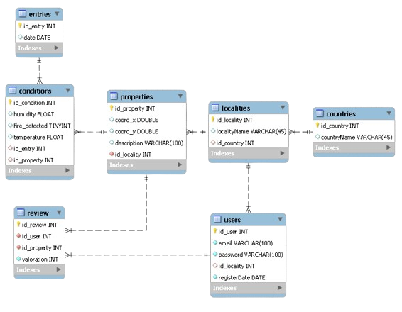

# TreeTracking

TreeTracking is a project that took place on a Fundación Esplai hackathon during June 2024. The project is about tracking and predicting vulnerabilities in green zones around the world.

## Installation

Install the dependencies of this project going to the frontend route and using:
```bash
  cd frontend/
  npm i
```
to install all the dependencies.

## Environment Variables

To run this project, you will need to add the following environment variables to your .properties file in the backend route:

```bash
cd backend/src/main/resouces
```

With the following variables:

`JDBC_URL`: Used to set-up the database where this project is running for.

`JDBC_USER`: User of the database (Our example is MySQL Workbench).

`JDBC_PASS`: Password of the database.

`WEATHER_API_KEY`: Api Key from the OpenWeatherMap.

`JWT_KEY`: JWT Key from the TokenService class.

## Database Design



## Deployment

To deploy this project you will have run the backend server using your JAVA IDE, making sure you have your Database Server running.

Then, you will have to run the frontend server, going to:

```bash
  cd frontend/
```

And then using:

```bash
  npm start
```
to run the Angular server.

## Authors

- [Carlos A. Díaz](https://github.com/dalbert9615)
- [Diego Aguero](https://github.com/DiegoAguero)
- [Javier Restrepo](https://github.com/jarestrepot)